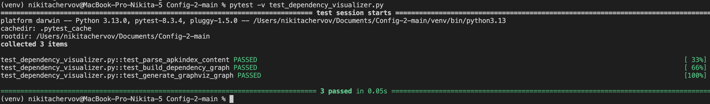

# Визуализатор зависимостей пакетов Alpine Linux

## 1. Общее описание
**Dependency Visualizer** — это инструмент для визуализации зависимостей пакетов Alpine Linux на основе файла APKINDEX. Программа загружает файл APKINDEX.tar.gz из указанного репозитория, распаковывает его, строит граф зависимостей заданного пакета и визуализирует его с помощью диаграмм Mermaid.

## 2. Описание всех функций и настроек

### Основные функции:

#### **download_and_extract_apkindex(repo_url):**

    Описание: 
    Загружает файл APKINDEX.tar.gz из указанного репозитория и распаковывает APKINDEX.

    Параметры:
    - `repo_url` (str): URL-адрес репозитория Alpine Linux.

#### **parse_apkindex_content(content):**

    Описание: 
    Парсит содержимое файла APKINDEX и возвращает словарь с информацией о пакетах.

    Параметры:
    - `content` (str): Содержимое файла APKINDEX.

    Возвращает:
    - `packages` (dict): Словарь с информацией о пакетах.

#### **build_dependency_graph(packages, pkg_name, graph, visited, depth=0, max_depth=10):**

    Описание: 
    Рекурсивно строит граф зависимостей для заданного пакета.

    Параметры:
    - `packages` (dict): Словарь с информацией о пакетах.
    - `pkg_name` (str): Имя пакета, для которого строится граф.
    - `graph` (list): Список ребер графа.
    - `visited` (set): Множество посещенных пакетов.
    - `depth` (int): Текущая глубина рекурсии.
    - `max_depth` (int): Максимальная глубина рекурсии (по умолчанию 10).

#### **sanitize_node_id(name):**

    Описание: 
    Преобразует имя узла в допустимый идентификатор для Mermaid, заменяя недопустимые символы.

    Параметры:
    - `name` (str): Исходное имя узла.

    Возвращает:
    - `sanitized_name` (str): Санитизированное имя узла.

#### **generate_mermaid_graph(graph):**

    Описание:
    Генерирует код диаграммы Mermaid на основе графа зависимостей.

    Параметры:
    - `graph` (list): Список ребер графа.

    Возвращает:
    - `mermaid` (str): Код диаграммы Mermaid.

#### **visualize_graph(mermaid_code, renderer_path):**

    Описание:
    Визуализирует граф зависимостей, создавая изображение на основе кода Mermaid.

    Параметры:
    - `mermaid_code` (str): Код диаграммы Mermaid.
    - `renderer_path` (str): Путь к программе рендеринга (например, mmdc).

## Настройки:

- `--renderer`: Путь к программе рендеринга Mermaid (например, mmdc).
- `--package`: Имя пакета, для которого необходимо построить граф зависимостей.
- `--repository`: URL-адрес репозитория пакетов Alpine Linux.
- `max_depth`: Максимальная глубина рекурсии при построении графа (по умолчанию 10). Можно изменить в коде функции `build_dependency_graph`.

## 3. Описание команд для сборки проекта

### Требования:
- Python 3.x
- Node.js (для установки Mermaid CLI)
- Mermaid CLI (mmdc)
- Библиотека `requests`
- Библиотека `tarfile` (входит в стандартную библиотеку Python)
- `pytest` (для запуска тестов)

### Установка зависимостей:

**Установите Node.js:**

    Установка nvm:
    ```bash
    curl -o- https://raw.githubusercontent.com/nvm-sh/nvm/v0.39.4/install.sh | bash
    ```
    Загрузите конфигурацию nvm:
    ```bash
    source ~/.bashrc  # или source ~/.zshrc, если используете zsh
    ```
    Установите последнюю LTS версию Node.js:
    ```bash
    nvm install --lts
    nvm use --lts
    ```

**Установите Graphviz:**

    На macOS установите Graphviz с помощью Homebrew:
    ```bash
    brew install graphviz
    ```

    Или для других систем следуйте инструкции на [официальном сайте Graphviz](https://graphviz.gitlab.io/download/).

**Установите библиотеку `requests`:**

    ```bash
    pip install requests
    ```

**Установите pytest для запуска тестов:**

    ```bash
    pip install pytest
    ```

### Сборка проекта:

1. Клонируйте репозиторий или скопируйте файлы `dependency_visualizer.py`, `APKINDEX`, и `test_dependency_visualizer.py` в рабочую директорию.
2. Запустите тесты, чтобы убедиться в корректной работе:
    ```bash
    pytest test_dependency_visualizer.py
    ```

## 4. Примеры использования

### Построение графа зависимостей для конкретного пакета

Команда:
```bash
python dependency_visualizer.py
```
## 5. Запуск тестов

```bash
pytest test_dependency_visualizer.py
```





